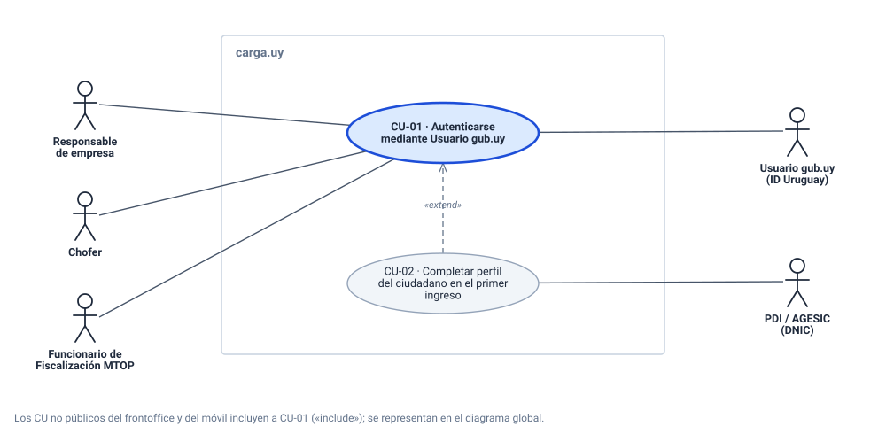
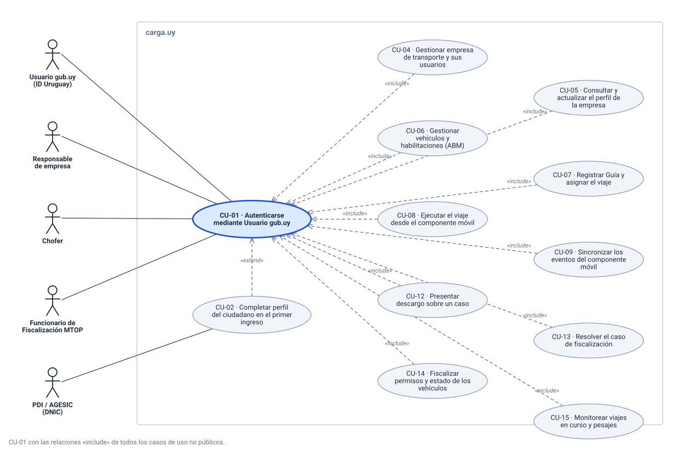
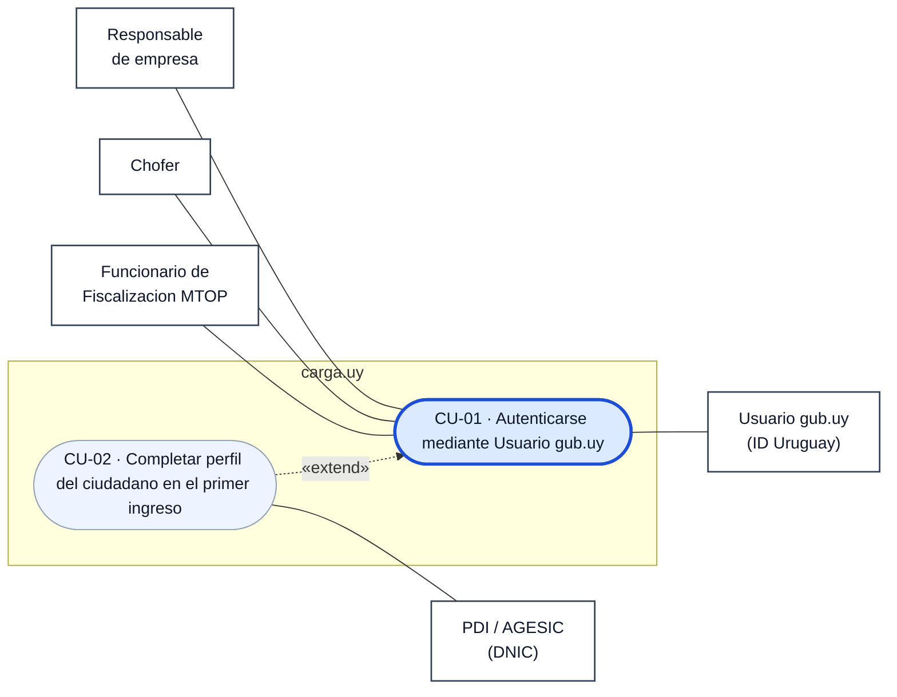

# CU-01 — Autenticarse mediante Usuario gub.uy

Delega la verificación de identidad en el proveedor de identidad de gub.uy y establece en
carga.uy una sesión con los roles del usuario.

| | |
|---|---|
| **Actor principal** | Ciudadano (responsable o chofer) / Funcionario de Fiscalización MTOP |
| **Actor secundario** | Usuario gub.uy (ID Uruguay) |
| **Canales** | frontoffice Web y componente móvil |
| **Relación** | `«include»` de todos los CU no públicos del frontoffice y del móvil |
| **Letra** | Sec. 3.1.1, 3.2.1, 3.3.1, 3.4.1, 3.7.4 |

## Diagrama de casos de uso

Con las relaciones `«include»` de todos los casos de uso no públicos:

Los dos SVG los genera [`tools/uml-usecase.js`](../tools/uml-usecase.js) — sin dependencias,
`node tools/uml-usecase.js` desde la raíz del repo.

## Decisiones del diagrama

- **CU-03 no está conectado a CU-01**, a propósito: el backoffice usa mecanismo interno
  (Sec. 3.6.1), no gub.uy.
- **CU-18 y CU-19 tampoco**: son públicos y no requieren autenticación.
- **Todos los actores van fuera de la frontera del sistema.** `Usuario gub.uy` y
  `PDI / AGESIC` son actores secundarios (sistemas externos), no casos de uso.
- Dirección de las relaciones: en `«include»` la flecha va **del caso base al incluido**;
  en `«extend»`, **del extensor al extendido**. La asociación actor–caso de uso es una
  línea sin punta.
- CU-01 va resaltado por ser **caso de uso crítico** para la arquitectura.

> `«uses»` es UML 1.x. Desde UML 2 son `«include»` y `«extend»`. La plantilla del SAD
> (Sec. 3.2) lista sólo Caso de Uso, Actor, Asociación y Frontera del Sistema, así que
> estas relaciones son un agregado nuestro, no un requisito.

Fuente Mermaid (alternativa)

Mermaid no tiene diagrama de casos de uso UML: no hay monigotes, los casos de uso no son
elipses y con muchas relaciones `«include»` convergiendo queda ilegible. Se mantiene sólo
como versión rápida de editar.

