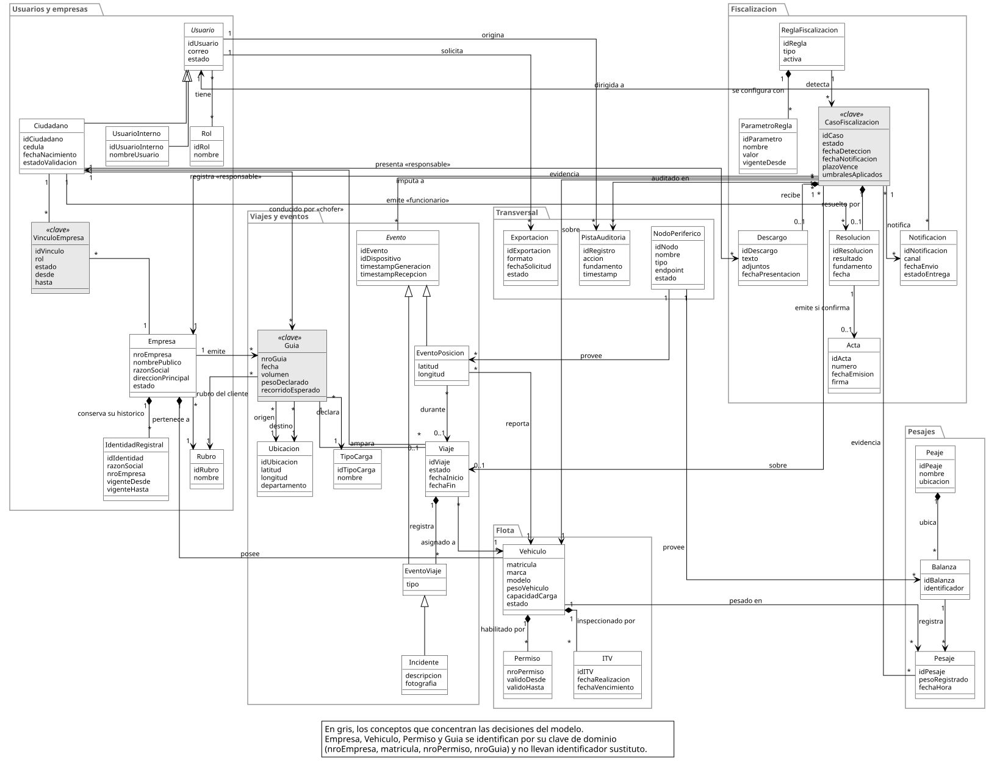
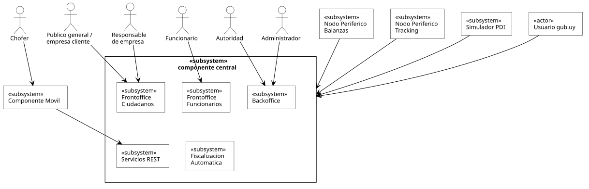
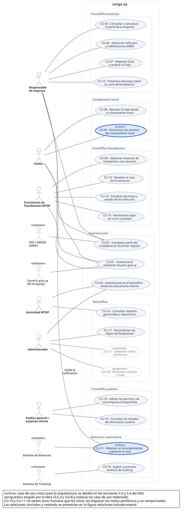
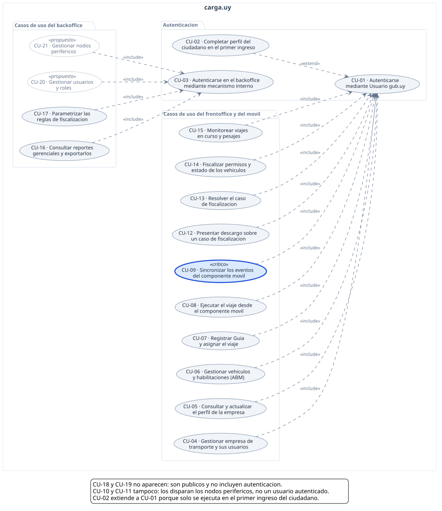

# use-cases — carga.uy

Artefactos del **Documento de Arquitectura de Software** de la plataforma **carga.uy**,
Laboratorio TSE 2026: modelo conceptual (SAD 2.2), vista de casos de uso (SAD 3) y la
especificación de cada caso de uso.

Las fuentes son PlantUML (`.puml`); los `.svg` son el render y se versionan para que GitHub
los muestre.

Todas las figuras siguen el estilo de los ejemplos de la plantilla (`sad_tse_2025.pdf`):
blanco y negro, monigotes para los actores persona y rectángulo `«actor»` para los actores
que son sistemas, contenedores `«subsystem»`, componentes con el icono clásico UML y
ruteo ortogonal en el modelo conceptual.

---

## Modelo Conceptual — SAD 2.2



Lleva identificadores sustitutos (`idUsuario`, `idCaso`, …) **siguiendo la Figura 2 de la
plantilla**, que los usa (`-idCiudadano`, `-idIniciativa`, `-idProceso`). La ortodoxia del
modelado conceptual diría que son implementación y no dominio, pero el ejemplo de referencia
de la cátedra los incluye y conviene no apartarse. Las entidades que ya tienen clave de
negocio —`Empresa`, `Vehiculo`, `Permiso`, `Guia`— se identifican por ella
(`nroEmpresa`, `matricula`, `nroPermiso`, `nroGuia`) y no llevan una sustituta.

### Decisiones del modelo

**`VinculoEmpresa` en vez de una clase `Chofer`.** Chofer y responsable no son subtipos de
ciudadano: son **roles dentro de una empresa**. Modelarlos por herencia hace imposible
expresar CU-04 4c — un ciudadano es responsable de **una** empresa y chofer de **varias**.
El vínculo además lleva `estado`, que cubre la asociación pendiente de CU-04 4a: se crea
antes de que el ciudadano se autentique por primera vez y se activa en su primer ingreso.

**`EventoPosicion` se asocia a `Vehiculo` (1) y a `Viaje` (0..1), no se compone en el viaje.**
Si todo evento perteneciera a un viaje, no se podría ni persistir una posición de un vehículo
sin viaje en curso — que es exactamente el hecho que dispara la regla *"viaje sin Guía"*
(3.5.8). Los `EventoViaje`, en cambio, sí se componen en el viaje: no existen sin él.

**`plazoVence` vive en `CasoFiscalizacion`, no en `Descargo`.** El plazo arranca cuando el
caso pasa a *notificada* (CU-11 paso 8) y corre aunque no haya descargo: CU-12 4a resuelve
el caso sin él. Si el plazo viviera en `Descargo`, no existiría hasta que alguien presentara
uno.

**`umbralesAplicados` en el caso.** CU-17 5a decide que los casos ya generados no se
recalculan al cambiar los umbrales. Para que eso sea verificable, el caso guarda una copia
de los valores vigentes al momento de detectar, no una referencia a la regla.

**`ParametroRegla` en vez de un único atributo `umbral`.** La regla de desvío tiene **dos**
parámetros —radio del corredor y tiempo continuo fuera— y 3.6.5 exige poder cambiarlos sin
redesplegar.

**`Permiso` e `ITV` como histórico compuesto en `Vehiculo`.** Hay que poder determinar si el
vehículo estaba habilitado **a la fecha de un viaje pasado** (3.5.7), aunque hoy tenga la
habilitación renovada. Un campo que se pisa no lo permite.

**La evidencia es asociación, no dependencia.** El caso **persiste** su evidencia (CU-11
paso 7, CU-12 paso 2); una dependencia `..>` expresaría un "usa" transitorio.

**Los roles se modelan una sola vez.** Las subclases de `Usuario` distinguen únicamente el
**mecanismo de autenticación** —`Ciudadano` por gub.uy, `UsuarioInterno` por credenciales
propias (3.6.1)—, y el rol funcional va en `Rol` y en `VinculoEmpresa.rol`.

**`Guia` lleva `pesoDeclarado` además de `volumen`.** La capacidad de carga se compara contra
un peso (3.5.6); el volumen alimenta el reporte por rubro (3.6.2). Con sólo `volumen` la
validación de CU-07 5b compara m³ contra kg.

**`Ubicacion` incluye `departamento`.** El dashboard filtra por ubicación geográfica (3.6.2);
con sólo latitud y longitud no hay dimensión por la cual agrupar.

---

## Vista Lógica — SAD 6.1



Arquitectura General del Sistema (Figura 4). Diagrama de componentes con los clasificadores
`«subsystem»` y `«component»`, como aconseja la plantilla en §6.

Las cajas se derivan, no se inventan: los componentes que la letra ya fija (§2 y §3.7), los
conectores que fija (§4.1 — SOAP con la PDI, REST con el móvil, request-response con
balanzas, mensajería con tracking), y los atributos de calidad que **obligan a separar**.
El caso claro: §3.5.a exige que la detección sea asincrónica *y no degrade la recepción de
los eventos*, y eso solo ya obliga a que el motor de detección no viva en el camino
transaccional — el Worker no es gusto, es un requisito.

Cada dependencia lleva el número de RNF que fija ese conector, para que la trazabilidad a la
letra se lea sin buscar.

**Observabilidad.** El identificador de correlación de §4.4.7 y el trace id de §4.4.9 son
la misma cosa: se propaga `traceparent` (W3C Trace Context) desde el móvil hasta el nodo
periférico y se emite en cada línea de log, con lo que un solo mecanismo cubre los dos
requisitos. La instrumentación es OpenTelemetry — ésa es la decisión arquitectónica; los
backends son intercambiables: Jaeger se cambia por Tempo tocando sólo el exportador del
Collector, sin tocar ningún componente.

Pendientes: los refinamientos 6.2–6.4 (central en capas, ingesta y detección, móvil) y los
diagramas de secuencia de 6.5.

## Vista de Casos de Uso — SAD 3.2



La plantilla del SAD (3.2) pide cuatro elementos: **Caso de Uso**, **Actor**, **Asociación**
y **Frontera del Sistema**; y sugiere incluir *todos* los casos de uso identificados,
marcando los críticos. Los paquetes internos no son un requisito: agrupan por subsistema
para que el diagrama se pueda leer.

### Relaciones «include» y «extend»



Van en una figura aparte: catorce dependencias convergiendo en los dos casos de uso de
autenticación vuelven ilegible la vista principal, y la plantilla no las exige.

Dirección de las relaciones (UML 2): **`«include»` va del caso base al incluido** — el base
siempre lo ejecuta; **`«extend»` va del extensor al extendido** — se ejecuta sólo bajo cierta
condición. En UML 1.x la relación `«include»` se llamaba `«uses»`.

## Actores — SAD 3.1

| Actor | Tipo | Canal |
|---|---|---|
| Responsable de empresa | primario | Web frontoffice |
| Chofer | primario | Componente móvil |
| Funcionario de Fiscalización MTOP | primario | Web frontoffice |
| Autoridad MTOP | primario (sólo lectura) | Web backoffice |
| Administrador | primario | Web backoffice |
| Público general / empresa cliente | primario | Web frontoffice público |
| Usuario gub.uy (ID Uruguay) | secundario — sistema externo | Proveedor de identidad |
| PDI / AGESIC (DNIC) | secundario — sistema externo | Web Services SOAP |
| Sistema de Balanzas | secundario — nodo periférico | Request-response HTTPS |
| Sistema de Tracking | secundario — nodo periférico | Mensajería asincrónica |

## Matriz actor × caso de uso

Cada actor se asocia a los casos de uso en los que **participa**, no sólo a la autenticación.

| Caso de uso | Actores primarios | Actores secundarios |
|---|---|---|
| CU-01 Autenticarse mediante Usuario gub.uy | Responsable, Chofer, Funcionario | Usuario gub.uy |
| CU-02 Completar perfil del ciudadano | Responsable, Chofer | PDI / AGESIC |
| CU-03 Autenticarse en el backoffice | Autoridad, Administrador | — |
| CU-04 Gestionar empresa y sus usuarios | Funcionario | — |
| CU-05 Consultar y actualizar perfil de empresa | Responsable | — |
| CU-06 Gestionar vehículos y habilitaciones | Responsable | — |
| CU-07 Registrar Guía y asignar el viaje | Responsable | — |
| CU-08 Ejecutar el viaje desde el móvil | Chofer | — |
| CU-09 Sincronizar los eventos del móvil | Chofer | — |
| CU-10 Ingerir y procesar eventos de tracking | — | Sistema de Tracking |
| CU-11 Detectar incumplimiento y generar caso | — | Sistema de Balanzas, Responsable (notificación) |
| CU-12 Presentar descargo | Responsable | — |
| CU-13 Resolver el caso de fiscalización | Funcionario | — |
| CU-14 Fiscalizar permisos y estado de vehículos | Funcionario | — |
| CU-15 Monitorear viajes en curso y pesajes | Funcionario | — |
| CU-16 Consultar reportes gerenciales | Autoridad | — |
| CU-17 Parametrizar las reglas de fiscalización | Administrador | — |
| CU-18 Validar los permisos de una empresa | Público general / empresa cliente | — |
| CU-19 Consultar los listados públicos | Público general | — |
| CU-20 Gestionar usuarios y roles *(propuesto)* | Administrador | — |
| CU-21 Gestionar nodos periféricos *(propuesto)* | Administrador | — |

Tres consecuencias de la matriz que se ven en el diagrama:

- **CU-10 y CU-11 no tienen actor humano que los inicie.** Los disparan los nodos periféricos
  y un temporizador. No es un error del diagrama: es la fiscalización automática de la
  Sec. 3.5 de la letra.
- **CU-03 no incluye a CU-01.** El backoffice usa mecanismo interno (Sec. 3.6.1), no gub.uy.
- **CU-18 y CU-19 no incluyen ninguna autenticación**: son públicos.

**CU-20 y CU-21 están marcados `«propuesto»`**: la letra los exige (3.6.3 gestión de usuarios
y roles, 3.6.4 gestión de nodos periféricos) pero todavía no tienen caso de uso redactado.
CU-21 además es precondición de CU-10, que asume el nodo de tracking ya registrado.

## Casos de uso críticos

La plantilla detalla **dos** casos de uso críticos (secciones 3.3 y 3.4), elegidos porque
intervenga el mayor número de componentes arquitectónicos y los más complejos:

| | Caso de uso | Por qué |
|---|---|---|
| 1 | **CU-09** Sincronizar los eventos del móvil | Componente móvil, REST sobre HTTPS, persistencia local, idempotencia y resolución de conflictos |
| 2 | **CU-11** Detectar un incumplimiento | Mensajería asincrónica, Sistema de Balanzas, pista de auditoría, notificación y umbrales parametrizables |

Crítico significa **arquitectónicamente significativo** —el caso de uso que *ejercita* los
elementos de las vistas—, no el más importante para el negocio ni aquel sin el cual el
sistema no funciona.

## Casos de uso

| Carpeta | Caso de uso | Letra |
|---|---|---|
| [CU01](CU01/) | Autenticarse mediante Usuario gub.uy | 3.1.1, 3.2.1, 3.3.1, 3.4.1, 3.7.4 |

## Cómo regenerar los diagramas

Con PlantUML instalado localmente:

```sh
plantuml -tsvg *.puml
```

Sin instalar nada, [`tools/render-puml.js`](tools/render-puml.js) renderiza contra el
servidor público de PlantUML (requiere red; el diagrama se envía a plantuml.com):

```sh
node tools/render-puml.js modelo-conceptual.puml modelo-conceptual.svg
node tools/render-puml.js vista-logica.puml vista-logica.svg
node tools/render-puml.js vista-casos-de-uso.puml vista-casos-de-uso.svg
node tools/render-puml.js relaciones-include-extend.puml relaciones-include-extend.svg
```
